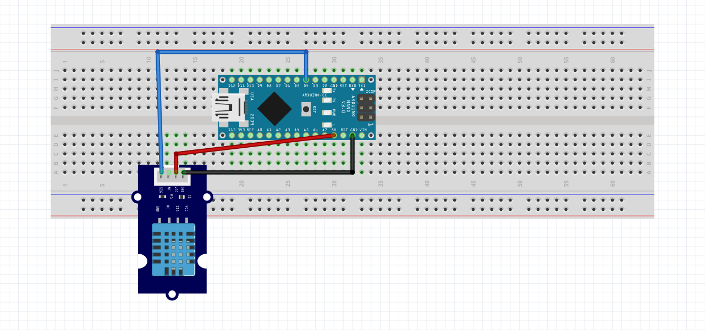

# 🌡️ Arduino DHT11 Temperature & Humidity Monitor

This is a simple Arduino project I created while **learning Arduino**.  
It reads **temperature** and **humidity** values from a **DHT11 sensor** and displays them on the **Serial Monitor**.

It’s a beginner-friendly project to practice working with sensors and serial communication.

---

## 🔧 Hardware Required

- Arduino (Uno/Nano/any compatible board)
- DHT11 Temperature & Humidity Sensor
- Jumper Wires
- Breadboard

---

## ⚡ Circuit Diagram

- **DHT11 VCC** → Arduino **5V**
- **DHT11 GND** → Arduino **GND**
- **DHT11 Data Pin** → Arduino **Digital Pin 4**

_(If your sensor has 3 pins, connect accordingly: VCC, Data, GND)_

 
 
---

## 💻 Code Explanation

The code uses the [`DHT`](https://github.com/adafruit/DHT-sensor-library) library to easily read values from the DHT11 sensor.

- Reads temperature in Celsius
- Reads humidity in %
- Prints values to the Serial Monitor every 2 seconds
- If the sensor fails, it shows an error message

---

## 🚀 Getting Started

1. Install the **DHT sensor library** in Arduino IDE:

   - Go to **Sketch → Include Library → Manage Libraries**
   - Search for **DHT sensor library by Adafruit**
   - Install it

2. Upload the code from this repository to your Arduino board.

3. Open **Serial Monitor** (9600 baud) to see the readings.
