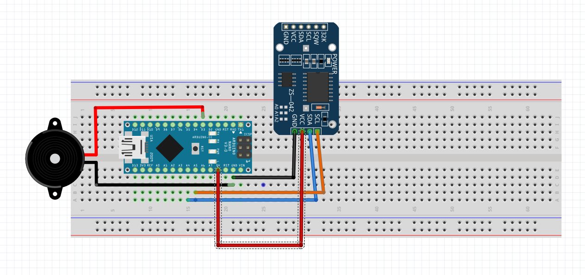
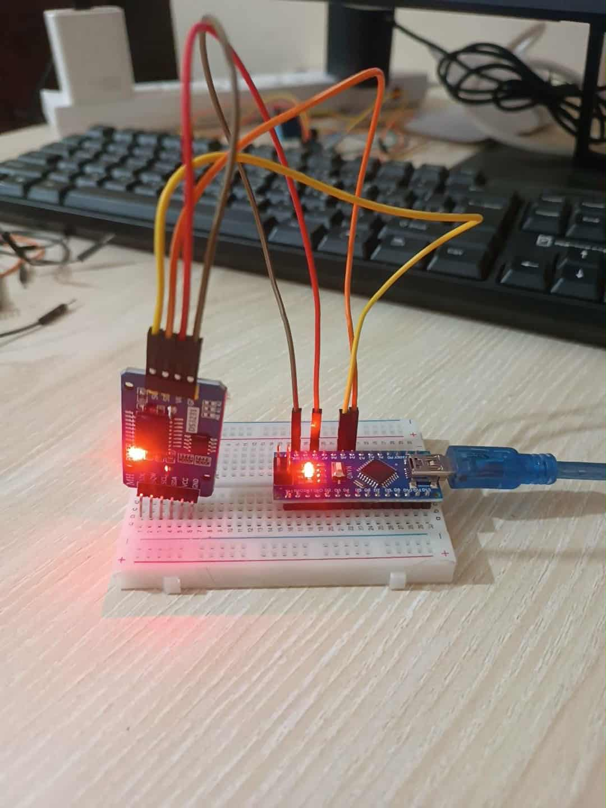

# ⏰ Arduino RTC Alarm Clock (DS3231 + Buzzer)

This is a simple project I created while **learning Arduino**.  
It uses a **DS3231 Real-Time Clock (RTC) module** to keep track of the current time and activates a **buzzer alarm** at a specific time (21:10).  

---

## 🔧 Hardware Required
- Arduino (Uno/Nano/any compatible board)  
- DS3231 RTC Module  
- Buzzer (active/passive)  
- Jumper Wires  
- Breadboard  

---

## ⚡ Circuit Connections
- **DS3231 VCC** → Arduino **5V**  
- **DS3231 GND** → Arduino **GND**  
- **DS3231 SDA** → Arduino **A4** (Uno)  
- **DS3231 SCL** → Arduino **A5** (Uno)  
- **Buzzer +** → Arduino **D3**  
- **Buzzer –** → Arduino **GND**  

*(If using a different Arduino board, check SDA/SCL pins.)*

 

---

## 💻 Code Explanation
1. Initializes **RTC DS3231** using the `RTClib` library.  
2. If the RTC loses power, it automatically resets the clock to the **code compilation time**.  
3. Continuously reads the **current hour and minute**.  
4. If the time matches **21:10**, the buzzer beeps every **5 seconds** for **30 seconds total** (6 cycles).  
5. Uses a `flag (alarmTriggered)` so the alarm rings **only once per day**.  
6. Resets the flag after the set time passes, so the alarm works again the next day.  

---

## 🚀 Getting Started
1. Install the required libraries in Arduino IDE:  
   - **RTClib** (by Adafruit)  
   - **Wire** (comes built-in)  

2. Upload the code to your Arduino board.  

3. Open the **Serial Monitor** (9600 baud) to see the current time and debug messages.  
 

## 🔍 Visual Overview

 
